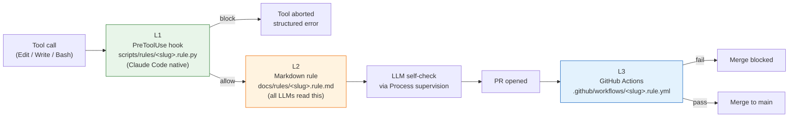

# ai-playbook

[](https://github.com/Wizarck/ai-playbook/actions/workflows/test.yml)
[](https://github.com/Wizarck/ai-playbook/actions/workflows/validate-pairing.rule.yml)
[](https://github.com/Wizarck/ai-playbook/actions/workflows/check-link-integrity.rule.yml)
[](https://github.com/Wizarck/ai-playbook/actions/workflows/check-doc-language.rule.yml)
[](https://github.com/Wizarck/ai-playbook/actions/workflows/check-rule-schemas.rule.yml)
[](https://github.com/Wizarck/ai-playbook/actions/workflows/docs-deploy.yml)

`ai-playbook` is a normative repository of universal rules, contracts, validators, and tutorials for LLM-driven development. It is **Diátaxis-inspired** (rules / concepts / runbooks / tutorials) and ships an **L1 / L2 / L3 paired-enforcement** architecture: every rule is enforced three times — by a Python PreToolUse hook at edit time, by a markdown rule loaded into the LLM's context, and by a GitHub Actions workflow at PR merge. The repo is **LLM-agnostic** by design — Claude Code, Gemini CLI, and Cursor all read the same `docs/rules/<slug>.rule.md` files; activation modes degrade gracefully where a host lacks native hooks. Every artefact is bound to a single slug, so the rule doc, the Python hardrule, the test suite, and the workflow file cannot drift apart silently.

## Architecture at a glance



One paired example: `cleanup-zombies.rule.md` (L2, the contract) ↔ `cleanup-zombies.rule.py` (L1, the hook + CLI validator) ↔ `cleanup-zombies.rule.yml` (L3, the workflow that runs the same validator on every PR). When L1 and L2 disagree, L1 is authoritative — the doc documents the hook, not the reverse.

## 60-second getting started

```bash
# 1. clone
git clone https://github.com/Wizarck/ai-playbook.git
cd ai-playbook

# 2. install as an editable Python package (validators import from scripts/)
pip install -e .

# 3. run the validators (all should print OK)
python scripts/validate_pairing.py
python scripts/check_link_integrity.py docs/
python scripts/check_doc_language.py docs/
python scripts/check_agents_md_size.py
python scripts/rules/cleanup-zombies.rule.py validate

# 4. run the test suite (~1000 tests in <30s)
python -m pytest tests/ -q
```

To consume the playbook as a submodule from your own project:

```bash
# inside your project root
git submodule add https://github.com/Wizarck/ai-playbook.git .ai-playbook
git submodule update --init --recursive
# pin to a release tag (semver — never track main)
cd .ai-playbook && git checkout v0.19.0 && cd ..
```

For the full guided 15-minute walkthrough, see [docs/tutorials/01-architecture-tour.md](docs/tutorials/01-architecture-tour.md).

## Consumers: how to bump (pull model)

The playbook itself runs **no automation against consumer repos**. Each consumer absorbs new tags at its own pace. Manual one-shot:

```bash
cd <your-project>/.ai-playbook
git fetch origin
git checkout vX.Y.Z          # the new tag you want to absorb
cd ..
git add .ai-playbook
git commit -m "chore(playbook): bump .ai-playbook to vX.Y.Z"
git push
```

For automated bump PRs, add a Dependabot config to your repo:

```yaml
# .github/dependabot.yml
version: 2
updates:
  - package-ecosystem: "gitsubmodule"
    directory: "/"
    schedule: { interval: "weekly" }
```

Or use Renovate, or a scheduled GitHub Action — whatever fits your stack. The playbook holds no registry of who consumes it, so no central pipeline ever opens PRs on your behalf. (This is the pull-model contract introduced in **v0.19.0**, retiring the prior `propagate-playbook-bump.yml` push pipeline.)

## Scope

| LLM / host | Status | Activation surface |
|---|---|---|
| Claude Code | Supported | Native PreToolUse / PostToolUse hooks (L1) + AGENTS.md context (L2) + Actions (L3) |
| Gemini CLI | Supported | `gemini_start.py` injection (L2) + Actions (L3); no native hook for L1 |
| Cursor | Supported | `.cursor/rules/<slug>.mdc` auto-materialised from `docs/rules/` (L2) + Actions (L3) |
| Copilot, Codex, Aider, Continue, Windsurf | **Out of scope** for v0.20.0 | Community PRs welcome post-1.0. |

The Diátaxis-inspired layout exposes four top-level doc types:

| Folder | Purpose | Length cap |
|---|---|---|
| [`docs/tutorials/`](docs/tutorials/INDEX.md) | Learning-oriented walkthroughs | uncapped |
| [`docs/concepts/`](docs/concepts/INDEX.md) | Reference + explanation | ≤300 lines per doc |
| [`docs/rules/`](docs/rules/INDEX.md) | Normative reference (paired with Python hooks) | ≤60 lines per doc |
| [`docs/runbooks/`](docs/runbooks/INDEX.md) | How-to procedures | ≤500 lines per doc |

Recommended reading order for a new contributor:

1. [`docs/tutorials/01-architecture-tour.md`](docs/tutorials/01-architecture-tour.md) — 15-min cold-start.
2. [`docs/concepts/enforcement-layers.md`](docs/concepts/enforcement-layers.md) — the L1 / L2 / L3 model with diagrams.
3. [`docs/concepts/taxonomy.md`](docs/concepts/taxonomy.md) — the vocabulary used everywhere.
4. [`docs/concepts/rule-use-cases-matrix.md`](docs/concepts/rule-use-cases-matrix.md) — every rule, one row, four enforcers.
5. [`docs/concepts/academic-foundations.md`](docs/concepts/academic-foundations.md) — the papers and specs that ground the design.

## Documentation site

The site is built with [mkdocs-material](https://squidfunk.github.io/mkdocs-material/) and indexed by [Pagefind](https://pagefind.app/) for fuzzy multi-word search. To build locally:

```bash
pip install mkdocs-material
mkdocs build --strict      # exits 0 on a clean tree
# optional: full static index (requires Node 18+)
npx pagefind --site site
```

The published site lives at <https://wizarck.github.io/ai-playbook/>.

## Versioning

Semver on the `main` branch. Consumers pin to a released tag, never `main`. Breaking changes require an RFC and a major bump. Current version: see [`VERSION`](VERSION) (`v0.19.0`). The v0.20.0 milestone is reserved for the final public reference cut on explicit maintainer approval; intermediate versions (v0.19.x) absorb post-review fix iterations.

## Status

**v0.19.0 — pull-model migration (BREAKING).** Retires the centralised `propagate-playbook-bump.yml` push pipeline, deletes the `consumers.yaml` registry, refactors `issue_sync.py` to read `tracker_kind` from each consumer's own AGENTS.md frontmatter. Each consumer now owns its tracker config + bump cadence; the playbook holds no consumer registry.

Prior milestones:

- v0.18.3 — polish for showcase + 10 deferred hardrules (Slice 7).
- v0.18.2 — telemetry pipeline + 5-CLI absorption + 14 deferred hardrules (Slice 6).
- v0.18.1 — Slice 5 doc content rewrite complete; strict-by-default validators.
- v0.18.0 — filesystem reorg + paired-enforcement tooling (BREAKING).
- v0.16.0 — doc-drift CI gate + test isolation fixes.
- v0.15.0 — `cleanup-zombies` hook.

## License

Internal to the Wizarck organisation. Content may be relicensed (MIT or compatible) once a public release is cut.

## Maintainer

See [`MAINTAINERS.md`](MAINTAINERS.md).
