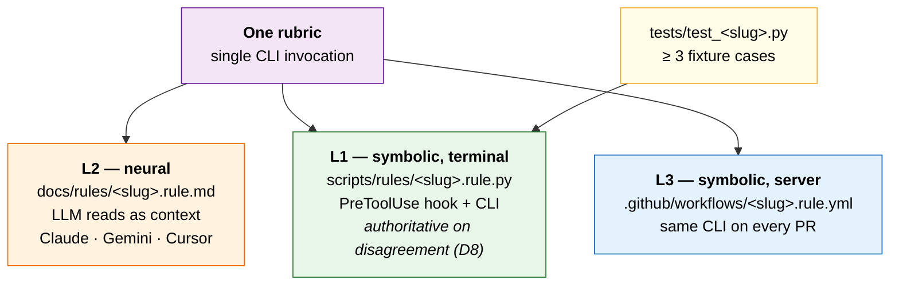
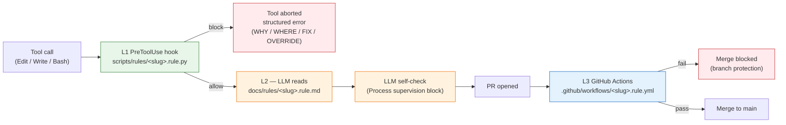
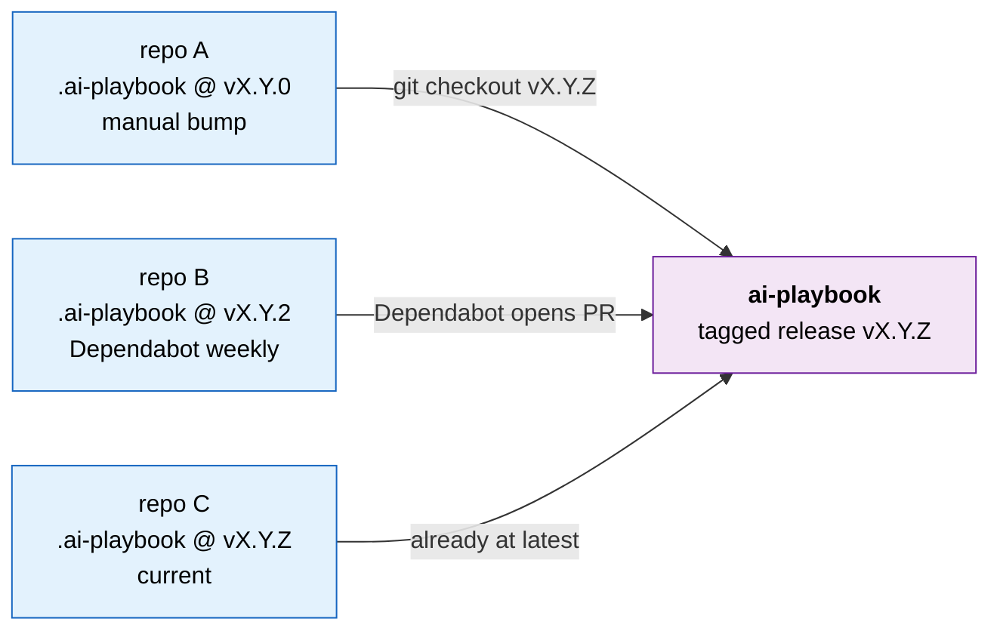

# ai-playbook

[](https://github.com/Wizarck/ai-playbook/actions/workflows/test.yml)
[](https://github.com/Wizarck/ai-playbook/actions/workflows/validate-pairing.rule.yml)
[](https://github.com/Wizarck/ai-playbook/actions/workflows/check-link-integrity.rule.yml)
[](https://github.com/Wizarck/ai-playbook/actions/workflows/check-doc-language.rule.yml)
[](https://github.com/Wizarck/ai-playbook/actions/workflows/check-rule-schemas.rule.yml)
[](https://github.com/Wizarck/ai-playbook/actions/workflows/docs-deploy.yml)

> **TL;DR** — Stop the silent drift between what your LLM thinks the rules are and what CI actually enforces. `ai-playbook` is an **LLM-agnostic, neuro-symbolic enforcement framework**: every rule is one slug bound to four paired artefacts (markdown contract + Python hook + GitHub workflow + tests). The validator refuses to ship if any pair disagrees. Claude Code, Gemini CLI, and Cursor all read the same files. Ships per-project as a git submodule, runs on Windows / macOS / Linux, and configures from a double-click HTML UI.

## The problem: rule drift is invisible until it isn't

LLM coding assistants follow rules you give them as prose. CI enforces rules you give it as code. Both rot. The doc says "test coverage ≥ 80%" while the workflow says ≥ 75%. The LLM honours the doc; the merge gate uses the workflow; nobody notices until a regression ships. Multiply across 30 rules × 3 LLMs × 12 months and you have a quiet, compounding quality regression nobody owns.

The usual answers solve **one** layer and leave the others to drift:

| Tool | Solves | Leaves drifting |
|---|---|---|
| Cursor Rules `.mdc` | LLM context (L2) | CI gate, terminal-side enforcement |
| `AGENTS.md` standard | LLM context (L2) | CI gate, terminal-side enforcement |
| Claude Code hooks | Terminal-side gate (L1) | CI, other LLMs |
| GitHub Actions only | CI gate (L3) | What the LLM was told in the first place |

`ai-playbook` binds all three layers under one slug, so they cannot drift silently.

## The answer: neuro-symbolic enforcement, paired three ways



This is the classic **neuro-symbolic composition pattern** ([IBM Research, 2023](https://research.ibm.com/blog/neuro-symbolic-ai)): the symbolic verifier owns the truth, the neural interpreter explains it to a human or another model. When L1 and L2 disagree, **L1 wins by contract** (decision D8 — see [`docs/concepts/enforcement-layers.md`](docs/concepts/enforcement-layers.md)). Drift becomes a bug the system catches itself.

A working example: every link under `docs/` MUST resolve. `link-integrity.rule.md` declares it (L2 contract). `link-integrity.rule.py` is the same check exposed as a PreToolUse hook + CLI validator (L1). `check-link-integrity.rule.yml` runs the same CLI on every PR (L3). `tests/test_link_integrity.py` covers fixture cases. Edit a markdown file with a dead link → the hook refuses the edit. Skip the hook → CI blocks the merge. `scripts/validate_pairing.py` refuses to ship if any of the four files goes missing — that is the keystone invariant.

## Runtime flow



## LLM-agnostic by design

Different LLM hosts expose different enforcement surfaces. `ai-playbook` compensates: L1 is best-effort where the host supports native hooks, L2 + L3 are the floor for everyone. A violating commit caught at edit time under Claude is still caught at PR merge under Cursor or Gemini — only the latency changes.

```mermaid
flowchart TB
    subgraph Claude["Claude Code (full stack)"]
        direction LR
        C1["L1 PreToolUse hook<br/>native"] --> C2["L2 AGENTS.md + rule.md<br/>auto-loaded"] --> C3["L3 GitHub Actions"]
    end
    subgraph Cursor["Cursor"]
        direction LR
        U1["L1 — none"] -.-> U2["L2 .cursor/rules/*.mdc<br/>auto-materialised from rule.md<br/>(4-mode activation)"] --> U3["L3 GitHub Actions"]
    end
    subgraph Gemini["Gemini CLI"]
        direction LR
        G1["L1 — none"] -.-> G2["L2 gemini_start.py<br/>injects always-loaded rules"] --> G3["L3 GitHub Actions"]
    end
    classDef have fill:#e8f5e9,stroke:#2e7d32
    classDef lack fill:#ffebee,stroke:#c62828,stroke-dasharray: 5 5
    classDef ok fill:#e3f2fd,stroke:#1565c0
    class C1,C2,U2,G2 have
    class U1,G1 lack
    class C3,U3,G3 ok
```



| LLM / host | L1 (hook) | L2 (context) | L3 (CI) |
|---|---|---|---|
| Claude Code | native PreToolUse | AGENTS.md + rule.md | Actions |
| Cursor | none | `.cursor/rules/*.mdc` (materialised) | Actions |
| Gemini CLI | none | `gemini_start.py` injection | Actions |
| Copilot / Codex / Aider / Windsurf / Continue | — | — | community PRs welcome |

## What's in the box

The product is the **rule library**: today **50 paired rules** codifying battle-tested AI-engineering practices. New community-validated practices land as new rules; outdated ones retire through the `cleanup-zombies` manifest so consumer repos auto-migrate. Around the library, four batteries wire it into your workflow without assembly.

### The 50-rule library: AI engineering best practices, enforced three ways

A non-exhaustive map by intent — the full live list with per-rule status (enforced / advisory) lives in [`docs/rules/INDEX.md`](docs/rules/INDEX.md):

| Intent | Representative rules |
|---|---|
| **Trust boundary / data hygiene** | `data-handling` (no PII in logs, session ids hashed before persistence), `secrets-handling`, `notification-no-secrets` |
| **Human-in-the-loop safety** | `hitl-approval-pattern` (async chat-channel approval with HMAC-validated reply, TTL + escalation ladder), `apply-fix-contract` (prod mutations gated on `verify_apply_safety` + idempotency, outcome recorded), `break-glass` (audited override surface) |
| **Verifiable output contracts** | `verdict-contract` (one canonical verdict line from a fixed four-literal set), `error-message-standard` (WHY / WHERE / FIX / OVERRIDE shape with stable exit codes 0/1/2/3), `subagent-envelope-schema`, `output-completeness` |
| **Self-check before completion** | `verification-before-completion`, `verify-existing-patterns`, `ai-reviewer-signoff` |
| **Multi-agent coordination** | `parallel-wave-anti-collision`, `delegated-shipping-prompt` |
| **Doc-as-code anti-drift** | `link-integrity`, `doc-drift-enforcement`, `english-only-docs`, `update-documentation` |
| **LLM-agnostic dispatcher hygiene** | `bootstrap-directive`, `dispatcher-cursor`, `dispatcher-gemini`, `gemini-session-start` |
| **Spec-driven work** | `openspec-scaffold`, `openspec-apply-enforcement`, `slice-preflight` |
| **Repo / submodule hygiene** | `gitignore-entries`, `cleanup-zombies`, `cleanup-on-bump`, `install-playbook` |

Per-rule × per-LLM obey-rate (once telemetry has signal): [`docs/concepts/rule-use-cases-matrix.md`](docs/concepts/rule-use-cases-matrix.md). The corpus is curated, not exhaustive — pull requests proposing a new rule MUST land all four paired artefacts (md + py + yml + tests) in the same PR, or the validator blocks merge.

### Configure from your browser — no localhost, no Node

A self-contained HTML UI at `<your-repo>/.ai-playbook/tools/config-ui/index.html`. **Double-click it** — it opens in your default browser, reads current state from a JS sidecar, and exposes three tabs: **Rules** (toggle any of ~50 rules at L1 / L2 / L3 with a `break_glass` reason audit), **Features** (Caveman mode + modes + components), **Global flags** (live env-var projection). Export produces an `applied-config.json` bundle that `scripts/apply_config.py` materialises into `rules-toggle.json`, `caveman.json`, and `feature-flags.env`. Cross-platform (Windows / macOS / Linux), per-project (lives inside the repo), no localhost, no Node, no daemon, no auth, no telemetry. Walk-through: [`docs/runbooks/use-config-ui.md`](docs/runbooks/use-config-ui.md).

### Caveman mode (~65 % output-token reduction)

A Python port of [JuliusBrussee/caveman](https://github.com/JuliusBrussee/caveman) (MIT), integrated with the playbook's hooks, materialise pipeline, and MCP wrapping. Toggle it from the config UI (or `scripts/caveman/cli.py`) to get compressed, telegraphic agent responses while preserving full technical accuracy: ~65–75 % fewer output tokens per turn, ~46 % fewer input tokens when applied to AGENTS.md / CLAUDE.md, and shorter MCP tool descriptions on every turn. Side effects (AGENTS.md materialise, `.mcp.json` wrap) are opt-in and documented per-component. Concept: [`docs/concepts/caveman-mode.md`](docs/concepts/caveman-mode.md).

### BMAD + OpenSpec hybrid planning

Two complementary planning systems shipped as one workflow. **BMAD** (skills like `bmad-agent-pm`, `bmad-agent-architect`, `bmad-agent-ux-designer`, the `bmad-testarch-*` family) drives discovery → planning → design through specialist agents with explicit gates (A / B / C / D / F). **OpenSpec** (slug-scoped change folders under `openspec/changes/<id>/`) turns the approved slicing into scaffolded proposals, design notes, and `tasks.md` consumed by the implementation rules (`openspec-scaffold`, `openspec-apply-enforcement`). The seam is one canonical artefact (`docs/openspec-slice.md`) that BMAD writes at Gate C and OpenSpec reads at Phase 3 — no retyping scope notes across 11+ changes per module. Bridge spec: [`docs/concepts/bmad-openspec-bridge.md`](docs/concepts/bmad-openspec-bridge.md).

### Telemetry — local-first, export-ready

Every L1 rule fire emits one JSONL row (`rule-event/v2` schema) to `<your-repo>/.ai-playbook-state/rule-events.jsonl`. **Local by default**: the directory is gitignored, sessions are one-way hashed (8 hex chars of SHA-256), PII keys (paths, diffs, messages, content) are stripped by an allow-list, and the playbook itself never phones home — there is no central collector. Aggregate offline with `python -m scripts.telemetry.report monthly` → markdown report with obey-rate × cost per rule × per LLM.

When you want to ship signals elsewhere, opt in to OpenTelemetry: `init_tracing` (see [`scripts/tracing/README.md`](scripts/tracing/README.md)) opens an `ai_playbook.rule.<slug>` span around every fire — point it at Langfuse, Tempo, Honeycomb, or any OTLP-compatible backend. Both transports are independently fail-safe: a failure in either path never alters the caller's exit code and never blocks the other. A dashboard tab inside the config UI surfacing live obey-rate / cost KPIs is on the roadmap, **not shipped yet** — today you read the metrics from the monthly markdown or your OTel backend. Schema, privacy guarantees, and academic grounding (IFEval, arXiv 2310.13361): [`docs/concepts/telemetry-design.md`](docs/concepts/telemetry-design.md).

## What this is NOT

- **Not a runtime framework.** Zero Python imports in your production code. The playbook only runs in dev + CI.
- **Not a hosted service.** It runs in your own GitHub Actions. We have no servers, no analytics pipe, no consumer registry.
- **Not a globally installed CLI.** It is a git submodule under `<your-repo>/.ai-playbook/`, pinned to a semver tag.

## 60-second quickstart

```bash
# 1. clone
git clone https://github.com/Wizarck/ai-playbook.git
cd ai-playbook

# 2. install as an editable Python package (validators import from scripts/)
pip install -e .

# 3. run the validators (all should print OK)
python scripts/validate_pairing.py
python scripts/check_link_integrity.py docs/
python scripts/check_doc_language.py docs/
python scripts/check_agents_md_size.py
python scripts/rules/cleanup-zombies.rule.py validate

# 4. run the test suite (~1200 tests in <30s)
python -m pytest tests/ -q
```

If `pip install -e .` fails with PEP 668 (`externally-managed-environment`) on a recent macOS / Linux, use a venv: `python -m venv .venv && source .venv/bin/activate` (Windows: `.venv\Scripts\Activate.ps1`), then re-run.

Consume the playbook as a submodule from your own project:

```bash
# inside your project root
git submodule add https://github.com/Wizarck/ai-playbook.git .ai-playbook
git submodule update --init --recursive
# pin to the current release tag (semver — never track main).
cd .ai-playbook && git checkout "v$(cat VERSION)" && cd ..
```

For the guided 15-minute walkthrough, see [`docs/tutorials/01-architecture-tour.md`](docs/tutorials/01-architecture-tour.md). **60 seconds to clone, ~15 minutes to internalise the L1 / L2 / L3 model.**

## How consumers absorb updates (pull model, no push)

The playbook runs **zero automation against consumer repos**. Each consumer absorbs new tags at its own pace. There is no central pipeline that opens PRs on your behalf; the playbook holds no registry of who consumes it.



*(There is no push pipeline drawing because there is no push pipeline — the `propagate-playbook-bump.yml` workflow was retired in v0.19.0.)*

Manual one-shot bump:

```bash
cd <your-project>/.ai-playbook
git fetch origin
git checkout vX.Y.Z          # the new tag you want to absorb
cd ..
git add .ai-playbook
git commit -m "chore(playbook): bump .ai-playbook to vX.Y.Z"
git push
```

Automate with Dependabot:

```yaml
# .github/dependabot.yml
version: 2
updates:
  - package-ecosystem: "gitsubmodule"
    directory: "/"
    schedule: { interval: "weekly" }
```

Renovate or a scheduled Action also work. (This pull-model contract was introduced in **v0.19.0**, retiring the prior `propagate-playbook-bump.yml` push pipeline.)

## Doc layout (Diátaxis-inspired)

| Folder | Purpose | Length cap |
|---|---|---|
| [`docs/tutorials/`](docs/tutorials/INDEX.md) | Learning-oriented walkthroughs | uncapped |
| [`docs/concepts/`](docs/concepts/INDEX.md) | Reference + explanation | ≤ 300 lines per doc |
| [`docs/rules/`](docs/rules/INDEX.md) | Normative reference (paired with Python hooks) | ≤ 60 lines per doc |
| [`docs/runbooks/`](docs/runbooks/INDEX.md) | How-to procedures | ≤ 500 lines per doc |

Recommended reading order for a new contributor:

1. [`docs/tutorials/01-architecture-tour.md`](docs/tutorials/01-architecture-tour.md) — 15-min cold-start.
2. [`docs/concepts/enforcement-layers.md`](docs/concepts/enforcement-layers.md) — the L1 / L2 / L3 model with diagrams.
3. [`docs/concepts/taxonomy.md`](docs/concepts/taxonomy.md) — the vocabulary used everywhere.
4. [`docs/concepts/rule-use-cases-matrix.md`](docs/concepts/rule-use-cases-matrix.md) — every rule, one row, four enforcers.
5. [`docs/concepts/academic-foundations.md`](docs/concepts/academic-foundations.md) — the papers and specs that ground the design (incl. IBM Neuro-Symbolic, Constitutional AI, IFEval, OWASP LLM Top 10).

## Documentation site

Built with [mkdocs-material](https://squidfunk.github.io/mkdocs-material/) and indexed by [Pagefind](https://pagefind.app/) for fuzzy multi-word search.

```bash
pip install mkdocs-material
mkdocs build --strict      # exits 0 on a clean tree
# optional: full static index (requires Node 18+)
npx pagefind --site site
```

The published site lives at <https://wizarck.github.io/ai-playbook/>.

## Versioning

Semver on `main`. Consumers pin to a released tag, never `main`. Breaking changes require an RFC and a major bump. **Current version is in [`VERSION`](VERSION)** — every other file in this repo reads it lazily, so a release only ever touches `VERSION` + `CHANGELOG.md` + the git tag.

## Status

For the per-release narrative (what shipped in each tag, deprecations, breaking changes), see [`CHANGELOG.md`](CHANGELOG.md).

## License

[MIT](LICENSE) © 2026 Arturo Ramírez.

## Contributing

See [`CONTRIBUTING.md`](CONTRIBUTING.md) for contributing guidelines and maintainer contact info.
