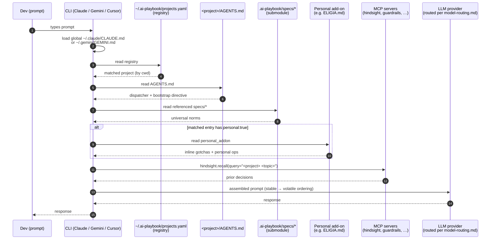

# architecture-diagrams.md

Mermaid diagrams visualising how the 3-level dispatcher, OpenSpec flow, and pre-commit gates compose at runtime. Populated in **T02h**. Three canonical flows below; add more as complexity grows.

## 1. Prompt → response flow

What happens when a dev types a prompt in any CLI (Claude Code, Gemini CLI, Antigravity, Cursor).



## 2. OpenSpec change — `/opsx:propose` → `archive`

What happens when the dev invokes `/opsx:propose` and works through the change until archive.

```mermaid
flowchart TD
    start([Dev invokes /opsx:propose]) --> propose[Write proposal.md]
    propose --> approve1{Human approves<br/>proposal?}
    approve1 -->|❌| propose
    approve1 -->|✅| parallel[specs/*.md || design.md<br/>concurrent artifacts]
    parallel --> qa1[QA subagent<br/>Blind Hunter + Edge Case + Acceptance]
    qa1 -->|⚠️ S1/S2| parallel
    qa1 -->|❓ CLARIFY| blocked((blocked-by-spec))
    qa1 -->|✅| tasks[Write tasks.md<br/>TDD-selective per layer]
    tasks --> qa2[Readiness check]
    qa2 -->|⚠️| tasks
    qa2 -->|✅| apply[openspec apply]
    apply --> impl[Implementation<br/>dev + QA parallel review]
    impl --> qa3[Final review]
    qa3 -->|⚠️| impl
    qa3 -->|✅| archive[openspec archive]
    archive --> specs[(openspec/specs/*.md<br/>updated)]
    archive --> retro[Post-archive retro<br/>specs/retrospective-cadence.md]
    blocked -.->|human unblocks| parallel
```

## 3. Pre-commit gate chain

What runs when the dev types `git commit`. Fails fast, exits non-zero on any gate.

```mermaid
flowchart LR
    commit([git commit]) --> pc1[trailing-whitespace]
    pc1 --> pc2[end-of-file-fixer]
    pc2 --> pc3[check-yaml]
    pc3 --> pc4[check-json]
    pc4 --> pc5[check-added-large-files<br/>≤500KB]
    pc5 --> pc6[gitleaks]
    pc6 --> pc7[schema_validate.py<br/>AGENTS.md]
    pc7 --> pc8[mcp/validate.py<br/>SSOT drift]
    pc8 --> pc9[block_manual_spec_edit.py<br/>openspec/specs/ guard]
    pc9 --> pc10[verdict_lint.py<br/>artifacts with ✅⚠️❓ + S1-S4]
    pc10 --> pc11[secrets_scan.py<br/>regex + gitleaks]
    pc11 --> pc12[prompt_injection_filter.py<br/>regex + LLM-as-judge Haiku]
    pc12 --> ok((✅ commit))

    pc6 -. 🚨 secret found .-> fail((❌ abort))
    pc7 -. ⚠️ schema violation .-> fail
    pc8 -. ⚠️ MCP drift .-> fail
    pc9 -. ⚠️ manual spec edit .-> fail
    pc10 -. ⚠️ missing verdict .-> fail
    pc11 -. 🚨 leak .-> fail
    pc12 -. 🚨 injection .-> fail

    fail -. --force-with-reason="…" .-> ok
```

## Notes

- Diagrams are **descriptive** of the target state. Not every gate exists at v0.1.0 — most scripts are stubs populated by downstream tracks (see each script's `populated in TXX` banner).
- If you change dispatcher semantics or pre-commit hook ordering, update the diagram in the same commit. Drift is enforced by T17 (live docs) and T22 (governance) — but the cheapest enforcement is the author's discipline.
- Mermaid rendering: GitHub renders natively. VS Code needs an extension. Cursor renders via its markdown preview.
