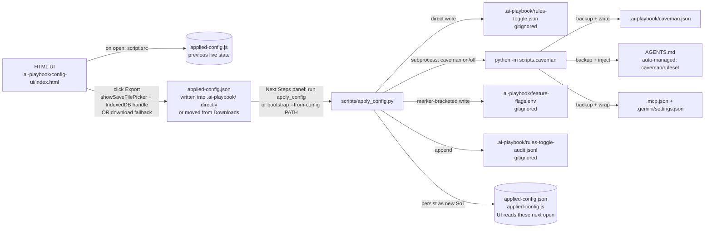
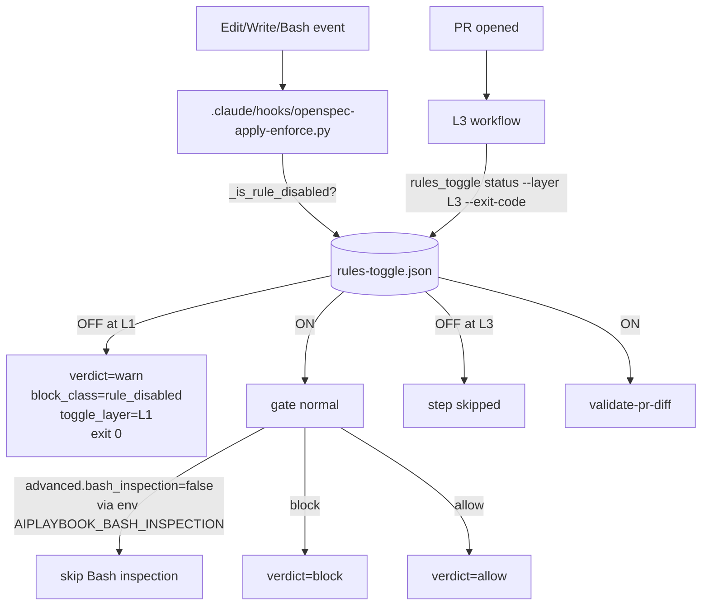

# ai-playbook config UI + bundle pipeline

## Why

The framework ships **~50 rules** across L1 (PreToolUse hooks + rule.py wrappers), L2 (markdown), and L3 (GitHub Actions). On top of that there are **installed features** with their own state files (caveman, graphify, ponytail) and **env-driven flags** (LLM routing strictness, telemetry feature flags, …).

Before this surface existed, an operator wanting to turn off a single rule for a hotfix had to: edit `.claude/settings.json`, set an env var with the right prefix (`AIPLAYBOOK_*_SKIP` / `AIPLAYBOOK_*_OVERRIDE`), and remember each rule has its own knob shape. That fragmentation is unmaintainable at our cadence.

**The fix**: one HTML UI, one bundle JSON contract, one applier. No new CLI flags duplicate the UI — the UI **is** the declarative surface.

## Six surfaces of toggleables

| Surface | What | Source of truth on consumer | Managed by |
|---|---|---|---|
| **Rules** | ~50 with paired L1/L2/L3 + optional per-rule advanced sub-toggles (e.g. `bash_inspection`). | `.ai-playbook/rules-toggle.json` (sparse — only modified entries; rules absent = ON). | `scripts/rules_toggle.py` (CLI) + `scripts/apply_config.py` (bundle applier). |
| **Features** | Installed components with their own state file + side effects (AGENTS.md materialisation, MCP wrap, backups). Today: caveman, graphify, ponytail. | One state file per feature (`.ai-playbook/{caveman,graphify,ponytail}.json`), each managed by its own CLI. | `scripts/{caveman,graphify,ponytail}` CLI — `apply_config` **delegates** via subprocess (one section per feature); never writes the files directly (schema-enforced). |
| **Global flags** | Binary env-driven toggles without their own state file (e.g. `AIPLAYBOOK_LLM_ROUTING_STRICT`). | `.ai-playbook/feature-flags.env` (marker-bracketed block). Consumer sources it in shell init (direnv `.envrc` or equivalent). | `scripts/apply_config.py` writes the file; per-rule `advanced` sub-toggles also project here via the inventory mapping. |
| **Skills enforcement** | Per-skill opt-out of the materialise step (negative-list). | `.ai-playbook-state/skills-enforce.json`. Default = all enforced. | `scripts/_enforce_state.py` (reader) + `apply_config.py` (writer). Honoured by `scripts/materialise_skills.py`. |
| **MCPs enforcement** | Per-server opt-out of MCP rendering (negative-list). | `.ai-playbook-state/mcps-enforce.json`. Default = all enforced. | Same as Skills. Honoured by `scripts/mcp/render.py` + `validate.py`. |
| **Managed files** *(v0.19.7+)* | AGENTS.md, .gitignore, .pre-commit-config.yaml, .coderabbit.yaml, .claude/settings.local.json, mcp-servers.project.yaml. Marker blocks delimit playbook-canonical content; everything outside markers is consumer-owned. | The files themselves are SSOT. `applied-config.json` + `.ai-playbook-state/backups/index.json` are audit-trail / discovery only. | `scripts/_renderers/` (pure render fns) + `scripts/_managed_files.py` (orchestrator). Backup-once before each overwrite. Consumer can curate per-block ("Take playbook" / "Keep mine") via the UI Files tab. |

The toggle state files live under `<consumer>/.ai-playbook/` and `<consumer>/.ai-playbook-state/` and are **gitignored**. The managed files themselves are committed by the consumer; bootstrap creates them, `apply_config` re-renders them (with backup-once protection).

Additionally, `apply_config` persists the just-applied bundle as a **fourth artefact pair** that lets the HTML UI render the current live state on next open:

- `.ai-playbook/applied-config.json` — canonical source of truth for "what's currently live". Same shape as the bundle the UI exports.
- `.ai-playbook/applied-config.js` — sidecar that assigns `window.APPLIED_CONFIG = <bundle dict>;`. The HTML loads it via `<script src="../../applied-config.js">` because browsers permit script-tag loads from `file://` even when `fetch()` is blocked.

The "current applied state" loop: open UI → reads `applied-config.js` → render → modify → **Export** (Chromium writes `applied-config.json` directly via `showSaveFilePicker` + a `FileSystemFileHandle` persisted in IndexedDB; Firefox/Safari drop it in `~/Downloads/` for a manual move) → run `apply_config` from the Next Steps panel's PowerShell/POSIX/Claude prompt → sidecar regenerates → re-open UI shows the new state. Both files are also gitignored.

## Diagram 1 — flujo de configuración (export → apply)



## Diagram 2 — runtime: layers consult the toggle



## Diagram 3 — internals de `apply_config`

```mermaid
flowchart TB
    BUNDLE[ai-playbook-config-bundle.json]
    BUNDLE --> VALIDATE[validate vs schema-ai-playbook-config-v1.json]
    VALIDATE -->|fail| ERR[abort, no writes]
    VALIDATE -->|ok| FORK{section present?}
    FORK -->|rules{}| R_WRITE[write rules-toggle.json<br/>+ derive env entries from advanced{} via inventory mapping<br/>+ audit line]
    FORK -->|features.caveman| CV_DELEGATE[subprocess: python -m scripts.caveman on --mode X --components csv<br/>OR python -m scripts.caveman off]
    FORK -->|global_flags{}| GF_WRITE[write/update .ai-playbook/feature-flags.env<br/>idempotent markers]
    R_WRITE --> AUDIT_R[audit JSONL line]
    CV_DELEGATE --> AUDIT_CV[audit JSONL line]
    GF_WRITE --> AUDIT_GF[audit JSONL line]
```

## When to use this vs the per-rule env-var override

| Need | Use |
|---|---|
| Persistent disable (days / weeks; CI gates, ops freeze, hotfix window) | **This UI** → `rules-toggle.json` or `feature-flags.env`. Persists across shells and CI runs. |
| One-shot (single command, immediate revert) | **Per-rule env var** (`AIPLAYBOOK_APPLY_ENFORCE_OVERRIDE=...`, `AIPLAYBOOK_CLEANUP_SKIP=1`, etc.). Lives only in that shell. |
| CI-only skip (workflow temporarily off for a release) | `rules.<slug>.layers.L3=false` in the bundle. The L3 workflow's `Check rule toggle` step skips the validate step automatically. |

The two surfaces are complementary, not redundant. The UI handles policy; the env vars handle shell-scoped override.

## Why caveman delegates to its CLI (and we do NOT write `caveman.json` directly)

The schema literal of `caveman-toggle/v1` declares: *"UI consumers MUST go through the CLI (python -m scripts.caveman) rather than touching the file directly."*

Reason: `cmd_on` executes **side effects before** writing the JSON — backup AGENTS.md, render the ruleset block from `skills/caveman/SKILL.md`, inject between the `auto-managed: caveman/ruleset:<mode>` markers, optionally wrap `.mcp.json` + `.gemini/settings.json` with `caveman-shrink`. Writing the JSON without those side effects leaves the consumer in an inconsistent state that `scripts/drift_check.py` will flag in CI.

`apply_config.py` therefore composes the right CLI arguments from the bundle and invokes `python -m scripts.caveman on/off ...` via subprocess. Subprocess overhead (~100ms) is irrelevant for a configuration apply (not a hot path).

**Upgrade path for v2**: refactor `cli.py:cmd_on/cmd_off` to expose `apply_state(project_root, target_state) -> SideEffects` as a public API. `apply_config` would then import it instead of subprocess. v1's subprocess approach is forward-compatible.

## Schemas

| Schema | File | Purpose |
|---|---|---|
| `ai-playbook-config/v1` | `schemas/schema-ai-playbook-config-v1.json` | Bundle wrapper the UI exports. `additionalProperties: false` at every level. |
| `rules-toggle/v1` | `schemas/schema-rules-toggle-v1.json` | Per-consumer rules state file. |
| `caveman-toggle/v1` | `schemas/schema-caveman-toggle-v1.json` | Unchanged. Bundle's `features.caveman` is a declarative subset. |
| `rule-event/v2` | `schemas/schema-rule-event-v2.json` | Telemetry event schema. **Additive update**: added `rule_disabled` to `block_class` enum + new optional `toggle_layer` field (`L1` / `L2` / `L3`). |

## See also

- [enforcement-layers.md](enforcement-layers.md) — L1/L2/L3 mental model (toggle is a meta-layer that short-circuits all three).
- [bundle-managed-files.md](bundle-managed-files.md) — files-as-SSOT redesign (v0.19.7): marker blocks, renderers, `bootstrap --update`, `migrate_to_bundle`, uninstall.
- [skills-mcps-enforcement.md](skills-mcps-enforcement.md) — per-Skill + per-MCP enforcement toggles.
- [telemetry-design.md](telemetry-design.md) — rule-event/v2 fields + privacy model.
- [caveman-mode.md](caveman-mode.md) — caveman feature internals.
- [graphify.md](graphify.md) — graphify feature internals.
- [ponytail-mode.md](ponytail-mode.md) — ponytail feature internals (caveman's code-minimalism twin).
- [../runbooks/use-config-ui.md](../runbooks/use-config-ui.md) — operator walkthrough.
- [../runbooks/upgrade-to-bash-enforcement.md](../runbooks/upgrade-to-bash-enforcement.md) — companion runbook for the v0.20.0 Bash inspection.
