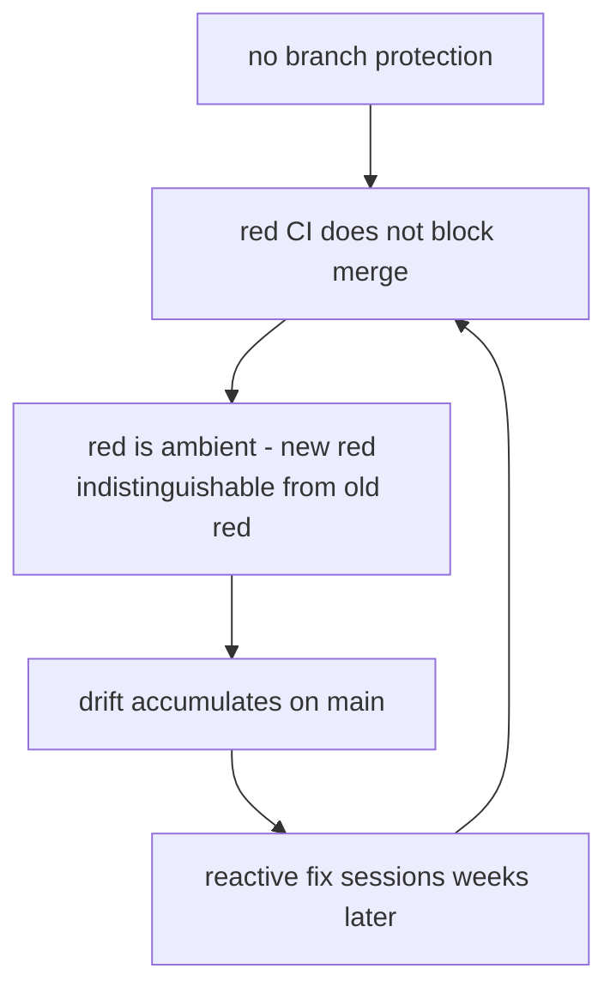

# Anti-drift gates — defense in depth for CI signals

## Why

Consumer repos accumulate the same breakage classes over and over: lint debt
merged while the lint step was red, schema migrations that outrun the e2e seed
scripts, parallel alembic heads, chronic-red test jobs that hide new
regressions, and big-bang dependency jumps. The root cause is rarely a missing
check — in the 2026-07-13 geeplo incident every failure had a CI step that went
red the moment the drift was born. The root cause is that the signal does not
gate: private repos on the GitHub free plan cannot enable branch protection, so
red CI merges anyway, red becomes ambient, and nobody can tell a new red from
an old one. Once red is ambient, every other check decays into noise.



## What

Four layers, cheapest and earliest first. Each layer catches what the previous
one missed; no single layer suffices.

| Layer | Where | Cost | What it catches |
| --- | --- | --- | --- |
| 1 — Laptop | pre-commit / pre-push hooks | seconds | lint debt ([lint-parity-precommit](../rules/lint-parity-precommit.rule.md)), forked migration chains ([alembic-single-head](../rules/alembic-single-head.rule.md)) |
| 2 — PR CI | workflow jobs | minutes | schema↔seed drift ([migrate-seed-smoke](../rules/migrate-seed-smoke.rule.md)), ratchet growth, everything layer 1 skipped |
| 3 — Merge lock | branch protection + required checks | ~4 USD/user/month (GitHub Team) for private repos | red merges — the only layer that breaks the loop above |
| 4 — Continuous | Renovate / dependabot, scheduled jobs | config once | big-bang dependency jumps, stale baselines |

Two principles cut across the layers:

- **Parity**: whatever gates in CI also runs on the laptop with the same pinned
  version. A linter that only exists in CI is a linter developers discover
  post-push; a linter that only exists locally drifts from what CI enforces.
- **Ratchets only go down**: baseline ratchets (`FOO_BASELINE: 91`-style
  count-and-compare steps) block growth, but a baseline nobody lowers is frozen
  debt. The step should also detect `count < baseline` and demand the number be
  lowered in the same PR — every accidental improvement gets consolidated:

```bash
if [ "$errors" -gt "$BASELINE" ]; then
  echo "::error::errors grew from $BASELINE to $errors"; exit 1
elif [ "$errors" -lt "$BASELINE" ]; then
  echo "::warning::errors dropped to $errors — lower BASELINE to $errors in this PR"
fi
```

Layer 3 cannot be enforced by playbook tooling (it is a GitHub plan + settings
decision), which is exactly why layers 1–2 exist as rules: they reduce the
frequency of drift even while the merge lock is absent, and become
required-check candidates the day it exists.

## How it relates to other concepts

- [enforcement-layers](enforcement-layers.md) — the playbook's own L1/L2/L3
  enforcement stack; anti-drift gates are the consumer-repo counterpart.
- [lint-parity-precommit](../rules/lint-parity-precommit.rule.md) — layer 1
  parity rule (binding).
- [migrate-seed-smoke](../rules/migrate-seed-smoke.rule.md) — layer 2 contract
  rule (binding).
- [alembic-single-head](../rules/alembic-single-head.rule.md) and
  [migration-slot-reservation](../rules/migration-slot-reservation.rule.md) —
  the migration-chain half of the same story.
- [pre-commit-hooks](../rules/pre-commit-hooks.rule.md) — the bootstrap rule
  that makes layer 1 possible at all.

## Concrete example

geeplo, 2026-07-13. A multi-tenant wave merged on 2026-07-12 with (a) 41 ruff
errors — the CI lint step went red but pre-commit did not run ruff, so the
authors never saw it locally, and without branch protection the red did not
block the merge — and (b) migrations `0070_organizations` /
`0072_child_tables_tenant_id`, which added NOT NULL columns
(`tenants.organization_id`, `user_access.tenant_id`) that
`scripts/bootstrap-test-db.py` never learned to fill. The backend job died at
lint before pytest ran; Playwright died at DB bootstrap before any of its 342
tests started. Diagnosis and repair took a dedicated session a day later.

With the gates in place: layer 1 (ruff in pre-commit, same pin as CI) stops the
lint debt on the author's laptop in under a second; layer 2 (a one-minute
migrate-seed-smoke job: fresh postgres → `alembic upgrade head` → seed twice)
fails the migration PR itself with a one-line NotNullViolation instead of a
20-minute Playwright job on someone else's PR days later; layer 3 (branch
protection) makes both non-negotiable.

## Further reading

- `templates/ci/migrate-seed-smoke.yml` — drop-in workflow job for layer 2.
