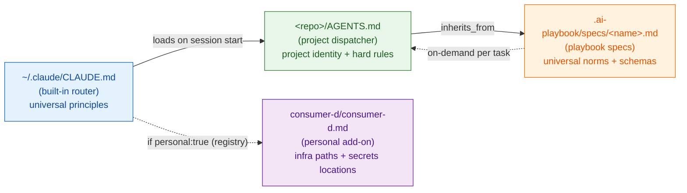
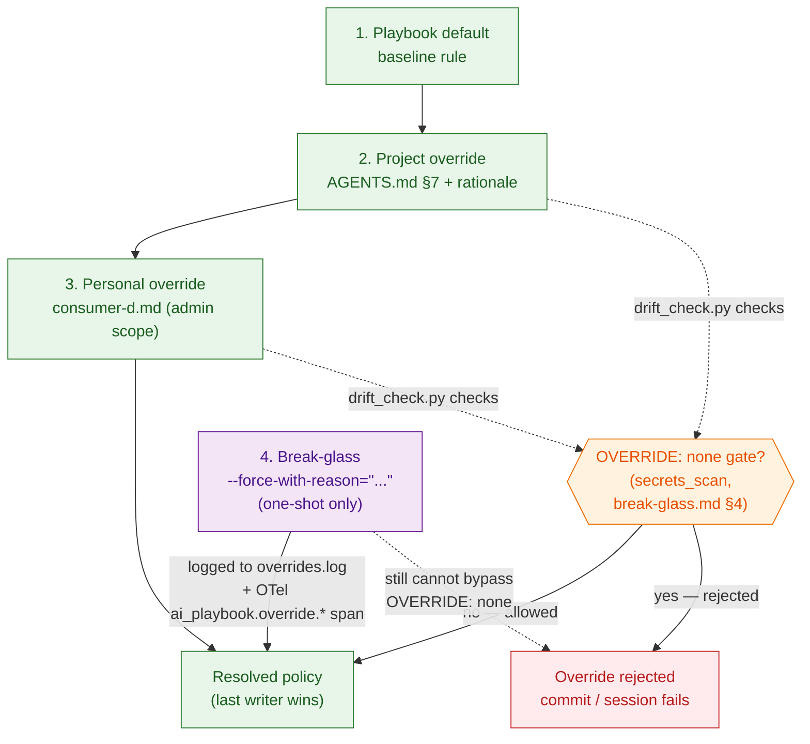

# Dispatcher Chain

## Purpose

Define the 3-level dispatcher inheritance model so any agent (Claude Code, Gemini CLI, Antigravity, Cursor) resolves the same rules regardless of which CLI invoked it. The chain is **LLM-agnostic** — CLI-specific pointer files (`CLAUDE.md`, `GEMINI.md`, `.cursor/rules/*.mdc`) are thin redirectors to a single `AGENTS.md` per project.

## Levels

1. **Universal — `ai-playbook/`** (this repo). Consumed via git submodule at `.ai-playbook/` inside each consumer project, pinned to a semver tag. Provides:
   - JSON Schema for `AGENTS.md` frontmatter (`specs/agents-md-v1.schema.json`).
   - Verdict/severity contract, break-glass contract, canonical error format, agentic-failure taxonomy.
   - Scripts (`scripts/*.py`) invoked by consumer pre-commit hooks, CI, and session-start helpers.
2. **Project — `<repo>/AGENTS.md`** at the root of every consumer repo. Inherits from the playbook via `inherits_from` frontmatter. Adds project identity, active work, hard rules, and the capability map. must not duplicate universal content; if a rule is universal, link to `.ai-playbook/specs/<spec>.md` instead of copying it.
3. **Personal add-on (maintainer only) — `consumer-d/consumer-d.md`**. Loaded conditionally by `~/.claude/CLAUDE.md` when the cwd resolves (via `~/.ai-playbook/projects.yaml`) to an entry with `personal: true`. Contains infra paths, SOPS key locations, VPS endpoints, BRAIN pointer. Never shipped to team devs.

CLI-specific routers (`CLAUDE.md`, `GEMINI.md`, `.cursor/rules/00-dispatcher.mdc`) are thin 5–10 line pointers that tell the CLI to read `AGENTS.md`. They carry **no policy**; removing them would not change the resolved ruleset.

## Resolution order

At session start, the CLI loads files in this order:

1. **Built-in router** (e.g. `~/.claude/CLAUDE.md`) → 8 universal principles + registry-lookup instructions.
2. **Project dispatcher** (`<repo>/AGENTS.md`) → inherits from pinned playbook tag.
3. **Playbook specs** — the agent reads `.ai-playbook/specs/<name>.md` on demand based on the task (never eagerly).
4. **Personal add-on** (the maintainer's machine only) if the registry flags the project `personal: true`.

No other files participate. Any rule not expressible in one of these three levels is out of scope.

### Diagram 1A — resolution pipeline

The Router → Project edge is eager (session-start load); Project → Specs is the static `inherits_from` declaration; Specs → Project is the on-demand read at task time. The Personal branch fires only when the registry entry matching cwd carries `personal: true`.

## Override semantics

### Precedence (last writer wins, with guardrails)

1. **Playbook default** applies unless explicitly overridden.
2. **Project-level override** — documented in `AGENTS.md` §7 "Overrides inherited from playbook" with rationale. Empty by default.
3. **Personal add-on override** (admin scope only) — documented inline in `consumer-d.md`; cannot override `OVERRIDE: none` gates.
4. **Break-glass** — `--force-with-reason="<text≥10 chars>"` on a CLI invocation only; never a durable override. Logged to `.ai-playbook/overrides.log` + emitted as OTel `ai_playbook.override.*` span (see `break-glass.md`).

### Diagram 1B — precedence + OVERRIDE: none guardrails

Green nodes are durable, allowed precedence steps. The orange diamond is the `OVERRIDE: none` guard enforced by `scripts/drift_check.py`. The purple break-glass branch is one-shot only (per CLI invocation) and still cannot pierce the `OVERRIDE: none` gate.

### Conflict detection

- `scripts/drift_check.py` detects duplicated universal content in project `AGENTS.md` (e.g. verdict contract copy-pasted instead of linked) and flags as `duplication` drift.
- `scripts/schema_validate.py` refuses AGENTS.md without an `inherits_from` frontmatter field (required since v1).
- Project overrides without the §7 rationale block fail `drift_check.py --check overrides`.

### What cannot be overridden

The following gates declare `OVERRIDE: none` in their canonical error and refuse `--force-with-reason`:

- Committing plaintext secrets (`secrets_scan.py`).
- Any gate listed in [break-glass.md](../rules/break-glass.rule.md) §4 with `OVERRIDE: none`.

Project dispatchers cannot weaken these by listing them in §7 — `drift_check.py` rejects overrides against `OVERRIDE: none` gates.

## Registry integration

Path resolution for rule (3) above is per-machine, not checked into git. The registry at `~/.ai-playbook/projects.yaml` maps cwd → project → (optional) `personal_addon` path. Schema and discovery contract live in [projects-registry.md](projects-registry.md). Rebuild with `python .ai-playbook/scripts/discover_projects.py`.

## See also

- [agents-md-v1.schema.json](../../schemas/schema-agents-md-v1.json) — frontmatter contract for level 2.
- [bootstrap-directive.md](../rules/bootstrap-directive.rule.md) — canonical `AGENTS.md` §0 block enforcing read order.
- [migration-guide.md](migration-guide.md) — v0 → v1 path for pre-frontmatter AGENTS.md files.
- [break-glass.md](../rules/break-glass.rule.md) — override mechanics + audit trail.
- [projects-registry.md](projects-registry.md) — per-machine YAML used for level-3 resolution.
- [taxonomy.md](taxonomy.md) — formal definitions for _dispatcher_, _router_, _skill_, _subagent_.
