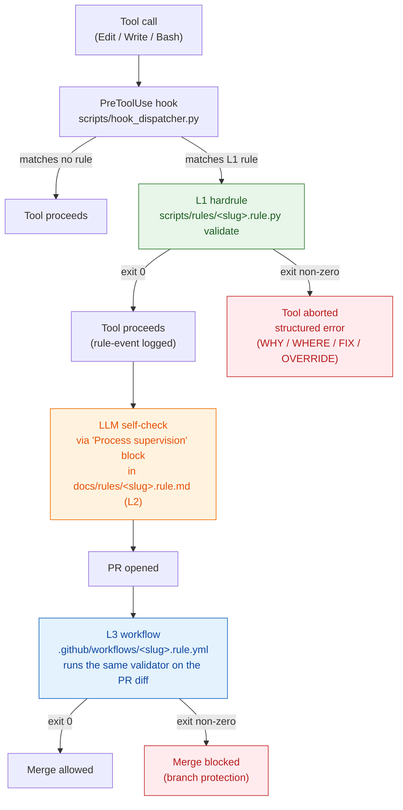
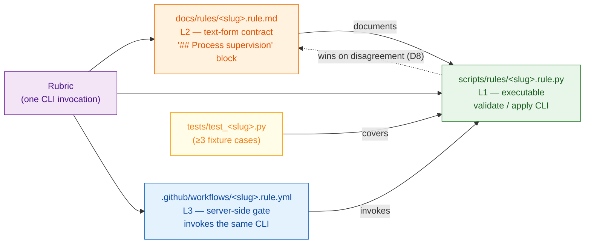

# Enforcement layers (L1 / L2 / L3)

## Why

A single enforcement mechanism leaves gaps. A Python pre-commit hook (L1) catches edits at the developer's machine but not in a CI run from a fork. A markdown rule loaded into an LLM's context (L2) influences the next response but does not block a non-LLM commit. A GitHub Action (L3) gates merge but adds minutes of latency and runs after the work is already done. Pairing all three closes the holes and produces an auditable defence-in-depth posture.

The paired-layer model also addresses cross-LLM portability. Claude Code has native PreToolUse hooks; Gemini CLI does not. An L2 markdown rule is the only enforcement an LLM without hook support sees in real time. L3 is the floor for everyone.

## What

| Layer | Mechanism | Location | Targets | Failure cost |
|---|---|---|---|---|
| **L1 — Hard terminal** | Python PreToolUse / PostToolUse hooks | `scripts/rules/<slug>.rule.py` | Claude Code (native hook support) | Low — caught at edit time |
| **L2 — Soft declarative** | Markdown rules loaded as LLM context | `docs/rules/<slug>.rule.md` | All LLMs (Claude, Gemini, Cursor) | Medium — caught at LLM compliance |
| **L3 — Hard server** | GitHub Actions + branch-protection required check | `.github/workflows/<slug>.rule.yml` | Server-side (no LLM) | High — caught at PR merge |

Every L1 hook is required to have a paired L2 doc (and vice versa); the invariant is enforced by `scripts/validate_pairing.py`. Exceptions — advisory-only rules with `paired_hardrule: null` — are documented in `enforcement-pairing-exceptions.md`.

### Diagram 1 — the L1 / L2 / L3 flow



### Same-rubric-two-enforcers protocol

1. The L2 doc declares the rubric in its `## Process supervision` section: "run `scripts/rules/<slug>.rule.py validate`, expect exit 0".
2. The LLM reads the doc, performs the action, self-checks via the validator, reports the verdict.
3. The L1 hook independently implements the same rubric as a PostToolUse hook.
4. The L3 workflow runs the same validator on the PR diff.

Outcomes:

- LLM self-checks ⇒ L1 confirms ⇒ consistent.
- LLM skips self-check ⇒ L1 PostToolUse catches it.
- LLM attempts to bypass ⇒ L3 catches it at PR merge.

### Diagram 2 — paired enforcement (one rubric, three enforcers)



### Tie-break protocol (D8)

When L1 and L2 disagree, L1 is authoritative. The `.rule.md` doc documents the hook; the hook owns the truth. The validator enforces byte-identical CLI invocation between the doc's `## Process supervision` block and the actual hook entrypoint — drift is treated as a doc bug, not a hook bug.

### Rule `.rule.py` contract

Every `scripts/rules/<slug>.rule.py` exposes a CLI with at least the `validate` subcommand. Some rules also expose `apply`, the optional remediation surface introduced in v0.20.0 (PR-B, ai-playbook-check orchestrator).

```bash
# Always present
python scripts/rules/<slug>.rule.py validate [<paths-or-args>]
# Exit codes: 0 ok, 1 violation, 2 schema break / fatal

# Optional (per-rule, additive — additive contract, never required)
python scripts/rules/<slug>.rule.py apply --dry-run
# Prints what `apply` would do; mutates nothing. Exit 0.

python scripts/rules/<slug>.rule.py apply
# Idempotent remediation. Exit 0 on success, 2 on schema break / fatal.
```

The two-mode design is aligned with Terraform (`plan` / `apply`), Ansible (`--check` / apply), kubectl (`diff` / `apply`), and ruff/eslint (`--check` / `--fix`). Rules that document a remediation in their L2 body but do NOT implement `apply` are **manual-fix only** — the orchestrator (`scripts/ai-playbook-check.py`) lists them with a pointer to the relevant runbook instead of offering auto-apply.

#### What `apply` MUST satisfy

1. **Idempotency** — running `apply` twice in a row on a converged state produces zero diff and exits 0. The implementation re-checks the invariant before mutating.
2. **Reversibility** — every state change is either trivially reversible (file edit, idempotent `git config`) or leaves a backup in-place (`<path>.pre-migration/` for filesystem reshapes). No silent destructive operations.
3. **Confirmation surface per rule** — high-blast-radius remediations implement their own confirmation prompt (e.g. typing the literal path before a folder rename). There is NO `risk_level:` / `destructive:` taxonomy in frontmatter — the rule decides what fence it raises internally. The orchestrator's global "apply this plan?" approval is not a substitute for rule-local fences.
4. **No partial mutations on failure** — if `apply` fails mid-way, the rule MUST either (a) complete the rollback before returning a non-zero exit code, or (b) leave a marker file that a subsequent `apply` detects and resumes from. Half-applied state is the worst outcome.
5. **Dry-run parity** — `apply --dry-run` MUST print the exact same set of mutations `apply` would perform. Drift between dry-run output and real apply is a rule-implementation bug.

#### What `apply` MUST NOT do

- Mutate state outside the rule's documented scope (e.g. `bare-layout.rule.py apply` MUST NOT touch unrelated `.gitignore` entries).
- Honour environment overrides that bypass the rule's own confirmation surface, unless explicitly documented (`--force-cwd-lock` for `bare-layout` is documented; an undocumented `--yes` flag that bypasses path-typing IS NOT acceptable).
- Call out to other rules' `apply` implementations. Chained remediation is the orchestrator's job, not a rule's.

#### Relationship to `apply-fix-contract`

The `apply-fix-contract` rule ([docs/rules/apply-fix-contract.rule.md](../rules/apply-fix-contract.rule.md)) covers a DIFFERENT surface: HITL-gated production mutations in `langgraph-aiops/` workflows. That rule mandates `hitl.request_approval` + `verify_apply_safety` + `record_apply_outcome` for runtime workflow mutations. This `.rule.py apply` contract covers local repo-state remediation invoked by a developer or the `ai-playbook-check` orchestrator — no HITL, no production blast radius, idempotent local file edits only. Same word ("apply"), different scopes.

#### Where `apply` is invoked from

- **Direct CLI** — a developer or a CI step runs `python scripts/rules/<slug>.rule.py apply` directly.
- **Orchestrator** — `scripts/ai-playbook-check.py` loads every rule via `hook_dispatcher.load_rules()`, runs `validate`, presents drift, and on user opt-in runs `apply` for the selected rules.
- **Skill** — `.claude/skills/ai-playbook-check/SKILL.md` wraps the orchestrator behind `AskUserQuestion` multi-select.

Rules without an `apply` implementation are NOT a contract violation — `validate`-only rules are the historical baseline. `apply` is purely additive.

### Diagram 3 — cross-LLM degradation

Different LLM hosts expose different enforcement surfaces. The playbook compensates by stacking L2 + L3 wherever L1 is unavailable.

```mermaid
flowchart TB
    subgraph Claude["Claude Code (full stack)"]
        C1["L1 — PreToolUse hook<br/>(native)"] --> C2["L2 — AGENTS.md + rule.md<br/>loaded into context"] --> C3["L3 — GitHub Actions"]
    end

    subgraph Cursor["Cursor (.mdc-based)"]
        U1["L1 — none<br/>(no PreToolUse equivalent)"] -.-> U2["L2 — .cursor/rules/&lt;slug&gt;.mdc<br/>auto-materialised from rule.md<br/>+ 4-mode activation"] --> U3["L3 — GitHub Actions"]
    end

    subgraph Gemini["Gemini CLI (minimal)"]
        G1["L1 — none<br/>(no PreToolUse equivalent)"] -.-> G2["L2 — gemini_start.py injects<br/>always-loaded rules into context"] --> G3["L3 — GitHub Actions"]
    end

    classDef have fill:#e8f5e9,stroke:#2e7d32
    classDef lack fill:#ffebee,stroke:#c62828,stroke-dasharray: 5 5
    classDef ok fill:#e3f2fd,stroke:#1565c0
    class C1,C2,C3,U2,U3,G2,G3 have
    class U1,G1 lack
```



Cursor and Gemini lose L1 but retain L2 + L3 — the floor stays intact. The cost is latency: a violating commit that would have been caught at edit time under Claude is now caught at PR merge time. The trade-off is documented in `cross-llm-activation.md`.

## How it relates to other concepts

- The discriminator that decides whether a doc is a rule (L2) or a concept (this doc) is the presence of `paired_hardrule:` in the frontmatter — see `enforcement-pairing-exceptions.md` for the advisory-only escape hatch.
- Per-LLM behaviour of the L2 layer (Cursor 4-mode activation, Gemini degradation) is documented in `cross-llm-activation.md`.
- The slug regex that binds the four artefacts (`.rule.py` / `.rule.md` / test / `.rule.yml`) at a single name is documented in `taxonomy.md` under "slug".
- Current enforcement status across the rule corpus is tracked in `enforcement-status.md`.
- Per-rule trigger / binding clause / workflow / live obey-rate is tabulated in `rule-use-cases-matrix.md`.
- Academic grounding for the paired-enforcement model lives in `academic-foundations.md`.

## Concrete example

Rule `cleanup-zombies` ships four paired artefacts bound by the slug:

```
scripts/rules/cleanup-zombies.rule.py     # L1 hook + CLI validator
docs/rules/cleanup-zombies.rule.md         # L2 doc, frontmatter slug: cleanup-zombies
tests/test_cleanup_zombies.py              # fixture coverage for L1
.github/workflows/cleanup-zombies.rule.yml # L3 required check
```

A consumer commit that violates the rule triggers three independent gates:

1. The developer's pre-commit fires `scripts/rules/cleanup-zombies.rule.py validate` (L1) and refuses the commit.
2. If the developer bypasses pre-commit (`git commit --no-verify`), the next LLM session loads `docs/rules/cleanup-zombies.rule.md` (L2) and refuses to ship the change without remediation.
3. If the commit still reaches a PR, the `.github/workflows/cleanup-zombies.rule.yml` (L3) required check blocks merge.

The byte-identical invocation in the doc's `## Process supervision` block is `python .ai-playbook/scripts/rules/cleanup-zombies.rule.py validate`. The L3 workflow runs the same command. The LLM self-check (L2 step 2) runs the same command. Three enforcers, one rubric.

## Further reading

- D8 (L1 authoritative on disagreement) — see the Slice-5 plan decisions doc.
- IBM Neuro-Symbolic AI patterns for paired symbolic + neural enforcement (see `academic-foundations.md`).
- OWASP LLM Top 10 — LLM01 prompt-injection countermeasures rely on L2 sandwich-defence + L3 server gates.
