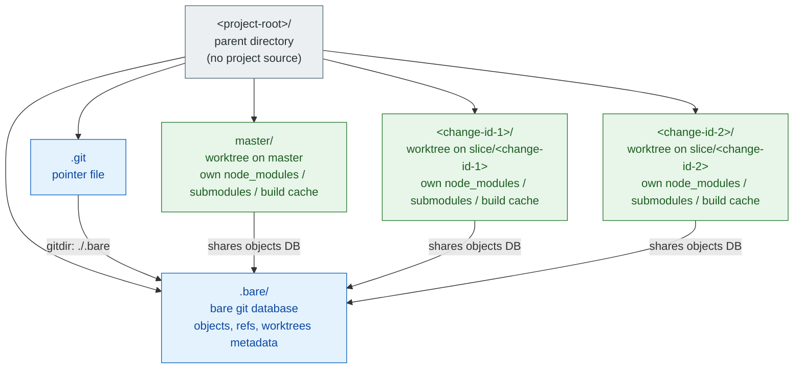

# Git Worktree Bare Layout

## Purpose

Define the canonical on-disk layout a consumer project uses when its workflow regularly produces multiple concurrent feature branches (the BMAD+OpenSpec hybrid produces one branch per OpenSpec change; modules of 10+ changes are normal). The single-working-tree default of `git clone` saturates at ~3 branches before context-switching, build-artefact contamination, and ad-hoc sibling-suffix directory naming (`repo-feature-x/`, `repo-bugfix-123/`) become operational pain.

The bare-repo + per-branch-worktree layout from senior-developer practice (Cugerone, Medeski, ChristopherA) makes every branch a peer subdirectory under one parent directory. One `.git` database is shared; each subdirectory is an isolated working tree with its own dependencies, build cache, and editor session.

## Layout

```
<project-root>/
├── .bare/                       # bare repo — the single git database
│   ├── HEAD
│   ├── config
│   ├── objects/
│   ├── refs/
│   │   ├── heads/               # local branches (populated by `git worktree add`)
│   │   └── remotes/origin/*     # mirror of GitHub branches
│   └── worktrees/               # per-worktree metadata managed by git
├── .git                         # FILE (not a directory). Contents: "gitdir: ./.bare"
├── master/                      # working tree on `master` branch
│   └── … (project source tree)
├── <change-id-1>/               # working tree on `slice/<change-id-1>` branch
│   └── … (project source tree, isolated from `master/`)
└── <change-id-2>/               # working tree on `slice/<change-id-2>` branch
    └── … (project source tree, isolated from siblings)
```

The parent directory is purely organisational — it contains no working files of the project itself, only `.bare/`, the `.git` pointer, and per-branch worktree subdirectories.

### Diagram 3C — bare-repo + per-worktree relationships



Every worktree shares the single object database in `.bare/` (deduplicated history, deduplicated objects) but keeps its own filesystem copy of working-tree state: `node_modules/`, initialised submodules, build artefacts, editor caches. Isolation lets two slices run their own `pnpm install` / build / test loops in parallel without contaminating each other; the shared DB keeps disk overhead bounded to working-tree state rather than full repo history per branch.

## Naming rules

| Element | Rule | Example |
|---|---|---|
| Project root | Lowercase repo name, no suffix. | `consumer-c/`, `consumer-d/` |
| Bare-repo dir | Always `.bare/`. | — |
| `.git` pointer | Always file with content `gitdir: ./.bare`. | — |
| Default branch worktree | Same name as the default branch (`master/` or `main/`). | `master/`, `main/` |
| Feature worktree | Same as the OpenSpec change-id (kebab-case folder name under `openspec/changes/`). | `m1-ingredients/`, `m2-recipes-core/` |
| Branch name in remote | `slice/<change-id>` per [release-management.md](release-management.md) §3.1. | `slice/m1-ingredients/` |

The directory-name-equals-change-id rule satisfies traceability principle 7 from the global CLAUDE.md (every cwd path resolves trivially to its OpenSpec change without translation).

## Invariants

I1. **The parent directory contains no project source.** Working files live exclusively under per-branch subdirectories. The parent has at most: `.bare/`, `.git`, and the per-branch worktree dirs. Tools that scan from the project root must descend into a worktree subdirectory.

I2. **One `.bare/` per project root.** Cloning a second `.bare/` into the same parent is a layout violation. Multiple consumer projects each get their own parent root.

I3. **Worktrees track distinct branches.** No two worktrees may check out the same branch. `git worktree add` enforces this at the git level; the layout adds no extra constraint.

I4. **Submodules are initialised per worktree.** Each worktree has its own filesystem copy of every submodule (git's design — submodules are working-tree state). Bumping a submodule in one worktree does not affect another until merged through the normal git flow.

I5. **The pointer file `.git` is required.** Without it, commands run from the parent dir do not find the bare repo (git looks for `.git` upward). The file content is exactly `gitdir: ./.bare` — a relative path so the layout is portable.

## Why bare + per-branch worktrees (vs alternatives)

Three layout candidates were considered (research synthesis, consumer-c migration 2026-05-01):

**A. Bare + per-branch siblings** (this spec). One database, every branch a peer subdir, atomic per-branch cleanup, no parent-dir pollution. Tradeoff: per-worktree `node_modules/` and build caches duplicate disk usage (acceptable cost for the isolation gain).

**B. Sibling-suffix in the project parent** (`repo/`, `repo-featureA/`, `repo-bugfix-123/`). The implicit pre-v0.9.0 default. Works for 1–3 worktrees; pollutes `~/Projects/` listings past 3–4; surface area for accidental "wrong-repo" actions when names collide across projects (`consumer-b-feature-x` vs `livekit-feature-x`).

**C. Centralised worktree pool** (`~/.worktrees/<repo>-<branch>/`). Hides the pool entirely. Tradeoff: editor multi-root workspaces get awkward; the `cd ~/projects/<repo>` muscle memory breaks; no co-location with the project's `.bare/`.

Rationale for A as default: directory-equals-change-id naming makes the cwd self-documenting (you can read the prompt and immediately know which OpenSpec change you are inside); atomic cleanup means a finished slice removes cleanly with `git worktree remove <change-id>` + `rm -rf <change-id>`; the parent dir stays a single line in `~/Projects/`; one shared `.bare/` keeps the object store deduplicated.

## Migration from legacy layout

Existing consumer projects on layout B (single working tree at `<repo>/`) keep working — no breaking change. Migration is voluntary, performed via [docs/runbooks/git-worktree-bare-setup.md](../runbooks/git-worktree-bare-setup.md) §3 (the runbook handles the Windows cwd-lock workaround). Once migrated, the registry path entry in `~/.ai-playbook/projects.yaml` is unchanged: `path` is the project parent directory, which the dispatcher resolution treats as "ancestor of cwd" (per [dispatcher-chain.md](dispatcher-chain.md) §"Registry integration"), so cwd in `<repo>/master/` resolves through the same registry entry as cwd in `<repo>/` did.

## Tooling

`scripts/wt_add.py` (introduced alongside this spec) wraps `git worktree add` with the playbook conventions:
- Takes a `<change-id>` argument; creates `<change-id>/` worktree at branch `slice/<change-id>` (configurable prefix).
- Defaults the base branch to the project default (auto-detected via `origin/HEAD`).
- Refuses to create a worktree whose name does not match an existing `openspec/changes/<id>/` folder unless `--no-slice-check` is passed (analogous to `/opsx:propose --no-slice` per [bmad-openspec-bridge.md](bmad-openspec-bridge.md)).
- On success, prints a follow-up hint pointing at `wt_remove.py` so the user discovers the retirement step without reading docs.

`scripts/wt_remove.py` closes the worktree lifecycle. After a `slice/<change-id>` PR is merged or closed:
- Verifies the PR state via `gh pr list --head slice/<change-id>` and refuses to proceed if it is still `OPEN` (override with `--force`).
- Runs `git worktree remove --force <change-id>` (the `--force` covers submodule directories git's bookkeeping does not track) and wipes any residue that survives.
- Deletes the local branch (`git branch -D slice/<change-id>`) unless `--keep-branch` is passed.

`scripts/wt_sweep.py` is the bulk counterpart for projects that have accumulated drift (many merged/closed PRs whose local `slice/*` branches were never retired). It scans every `slice/*` branch, queries GitHub for each PR's state, and prints a deletion plan; `--apply` executes it; `--remote` additionally `git push --delete origin <branch>`; `--include-worktrees` retires dangling worktrees as well. Use periodically (or once, retroactively) to keep `git branch --list 'slice/*'` honest. Pair with enabling **"Automatically delete head branches"** at the GitHub repo level so new PRs auto-clean their remote head and the sweeper only needs to handle local + historical drift.

`git worktree repair` (built-in) restores absolute paths in worktree metadata after the parent directory is renamed — the runbook calls this out as the recovery step for the Windows rename-while-cwd-locked case.

## Cross-references

- [docs/runbooks/git-worktree-bare-setup.md](../runbooks/git-worktree-bare-setup.md) — operational runbook (greenfield + migrate + daily flow).
- [scripts/wt_add.py](../../scripts/wt_add.py) — helper for daily worktree creation.
- [scripts/wt_remove.py](../../scripts/wt_remove.py) — helper for retiring a single worktree + branch after PR merge/close.
- [scripts/wt_sweep.py](../../scripts/wt_sweep.py) — bulk-clean zombie `slice/*` branches whose PR is resolved.
- [release-management.md](release-management.md) §3.1 — `slice/<change-id>` branch naming this layout depends on.
- [bmad-openspec-bridge.md](bmad-openspec-bridge.md) — the slicing artefact whose change-ids become worktree directory names.
- [runbook-bmad-openspec.md](runbook-bmad-openspec.md) §3.6 — "1 branch = 1 OpenSpec change = 1 PR" contract this layout operationalises.
- [projects-registry.md](projects-registry.md) — registry path semantics (parent-of-cwd resolution survives the migration unchanged).
- [dispatcher-chain.md](dispatcher-chain.md) — confirms why the registry entry needs no edit when migrating.
