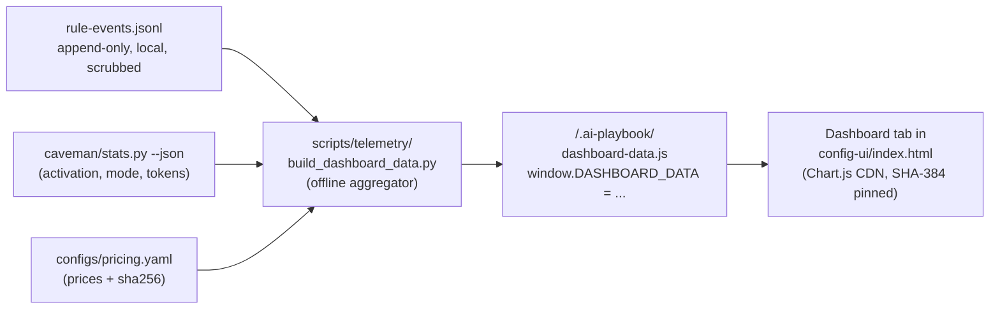

# Telemetry dashboard (config UI tab)

> **Status: spec (post-BMAD).** The panel structure, the data contract, and the
> success criteria below were validated through a BMAD product-brief cycle
> (brainstorming → contextual-discovery → guided-elicitation → draft-and-review
> → finalize). The brief and the LLM-distillate live under
> `_bmad-output/planning-artifacts/telemetry-dashboard/` (gitignored scratch).
> Field names and exact thresholds may still be tightened during PRD /
> architecture phases; the structural choices are not expected to change.

## Why

The playbook already records every rule firing, every break-glass, every Caveman session to `<consumer>/.ai-playbook-state/rule-events.jsonl` (schema `rule-event/v2`, gitignored, PII-scrubbed) and a monthly markdown via `scripts/telemetry/report.py`. The evidence is rich. It is also invisible.

Three groups of humans need that evidence:

- **Developers** asking "is this submodule helping or hurting my flow?" Today: open a terminal, remember the report command, read a wall of text. In practice: never.
- **Engineering managers** asking "what does the playbook do for us?" Today: arm-waving.
- **Internal auditors** asking "show me your guardrails are enforced (OWASP LLM01)." Today: nothing to point at.

A markdown report would solve the data-on-disk problem but not the discovery problem — developers do not reliably run CLIs (Five Whys root cause; see the distillate §7). The dashboard's real job is *pull-to-passive conversion*: move the data from "fetch on demand" to "present at a surface the developer already uses". The cheapest such surface is the config UI that already exists at `<consumer>/.ai-playbook/tools/config-ui/index.html`: same double-click entry, same sidecar pattern, same chrome, same cross-platform reach, zero new dependencies beyond Chart.js.

## What

A new top-level tab **Dashboard** in the existing config UI, sibling to **Rules / Features / Global flags / Preview JSON**. A single scrollable column: hero + secondary stats + five panels + footer.

### Hero — Incidents Prevented (7d)

A single large number. Definition: count of `rule-event/v2` events where `verdict="block"` AND no break-glass override was applied. Warnings are excluded. Overridden blocks are excluded.

Sub-count rendered immediately below: **Prompt-injection blocks (OWASP LLM01)** — events where `escape_hatch=true` OR `block_class="cmd_injection"`. The auditor's number.

### Secondary stats (small, under the hero)

- **Obey-rate (7d)** — `verdict="allow" ∪ "warn"` ÷ all events.
- **Estimated cost saved by Caveman ($)** — sourced from `scripts/caveman/stats.py --json`; displayed alongside the pricing-version timestamp (the sha256 of `configs/pricing.yaml` at aggregator run time). No fabricated precision.
- **Health emoji** — 🟢 obey-rate ≥ 95 %, 🟡 85 % ≤ obey-rate < 95 %, 🔴 obey-rate < 85 %.

### The five panels

| Panel | Shows | Source field(s) |
|---|---|---|
| **Obey-rate trend** | 7- or 30-day sparkline with delta vs prior window | per-day buckets |
| **Rule × LLM agreement matrix** | per-rule obey-rate for each LLM (Claude / Gemini / Cursor); **drift** flag in two senses — cross-LLM disagreement above threshold for the same rule in the current window, AND per-LLM time-over-time change vs the prior window | `slug × llm` aggregation |
| **Honesty meter** (`self_check ↔ verdict` agreement) | per LLM, how often the LLM correctly reports whether it followed a rule. The only metric on the dashboard that SaaS observability tools structurally cannot compute (they do not run hooks). | `self_check` × `verdict` parallel fields |
| **Top friction rules** | rules with the most break-glass overrides in the window, with top override-reason buckets | `verdict="block"` × `override_reason` |
| **Caveman impact** | activation rate, current mode (lite / full / ultra), components on/off, tokens_in/out delta, honest cost-saved estimate with methodology link. When Caveman is disabled or `caveman.json` is missing, the panel renders an explainer instead of charts. | `scripts/caveman/stats.py --json` + rule-event tokens |

### Footer

- Privacy banner — "Reads only fields the playbook is already authorized to record. `target_rel` is rendered in glob form (`.env` → `*.env`); individual file paths never appear; raw Bash commands are never present in the source data."
- Pricing-version timestamp.
- Skipped-line count if `>0` for the current window.
- (If OTel configured in `feature-flags.env`) deep-link to the configured backend.

### Empty state

For consumers with fewer than 100 events in the window, all panels are suppressed; the tab shows a pedagogical explainer and a link to [`telemetry-design.md`](telemetry-design.md). The threshold is a top-level key in the data contract (`empty_state_threshold: 100`) and is not hard-coded in the renderer.

## Data flow (sidecar pattern)



Browsers block `fetch()` on `file://` (the established constraint that drove `applied-config.js`), so aggregation MUST happen Python-side and reach the browser via a `<script src=>` sidecar.

## Refresh model

Three modes, in priority order:

1. **Post-hook of `apply_config`** — automatic regeneration on every config bundle apply. Establishes the freshness contract: data is at least as fresh as the last config change.
2. **Manual refresh from the tab** — because browsers cannot shell out from `file://`, the **Refresh** button does NOT run the aggregator directly. It copies the command (`python -m scripts.telemetry.build_dashboard_data`) to the clipboard and shows next-steps instructions, mirroring the existing UI's "Apply bundle" affordance. Consumers running the UI via `python -m http.server` (already documented in [`use-config-ui.md`](../runbooks/use-config-ui.md)) get a true async refresh path; that is optional, not required.
3. **Opt-in cron entry** — off by default; documented in the runbook.

## Data contract — `dashboard-data/v1`

```json
{
  "schema_version": "dashboard-data/v1",
  "generated_at": "<ISO 8601 UTC>",
  "pricing_version": "<sha256 of configs/pricing.yaml at run time>",
  "window": {
    "days": 7,
    "from_iso": "<ISO date>",
    "to_iso":   "<ISO date>",
    "events_seen": 4218,
    "events_skipped": 0
  },
  "empty_state_threshold": 100,
  "caveman_state": "on",
  "panels": {
    "hero": {
      "incidents_prevented_7d": 23,
      "prompt_injection_blocks": 4
    },
    "secondary": {
      "obey_rate_7d": 0.94,
      "cost_saved_usd": { "value": 38.20, "methodology": "docs/concepts/caveman-mode.md#cost-methodology" },
      "health_emoji": "green"
    },
    "trend": {
      "points": [
        { "iso_day": "2026-05-20", "obey_rate": 0.91, "events": 612 }
      ]
    },
    "matrix": {
      "rows": [
        {
          "rule_slug": "no-cmd-injection",
          "by_llm": { "claude": 0.98, "gemini": 0.96, "cursor": 0.92 },
          "drift_flag": "none"
        }
      ]
    },
    "honesty": {
      "rows": [
        { "llm": "claude", "self_check_verdict_agreement_rate": 0.97, "n_events": 2100 }
      ]
    },
    "friction": {
      "rows": [
        {
          "rule_slug": "no-secrets-in-logs",
          "break_glass_count": 12,
          "override_reasons_top": ["legitimate redact", "test fixture"]
        }
      ]
    },
    "caveman": {
      "activation_rate": 0.83,
      "mode": "full",
      "components": { "response_style": true, "compress_docs": true, "subagents_cavecrew": true, "commit_caveman": true, "review_caveman": true, "mcp_shrink": true },
      "tokens_in_delta": -1230,
      "tokens_out_delta": -3140,
      "cost_saved_usd": 38.20
    }
  }
}
```

When `caveman_state` is `"off"` or `"missing"`, the `caveman` panel is replaced with `{ "state": "off" }` or `{ "state": "missing" }` and the renderer shows the explainer instead of charts.

The JSON schema lands at `schemas/schema-dashboard-data-v1.json` and is validated by the aggregator on write. Aggregator writes are atomic (write-to-temp + rename); a crashed run never leaves a partial sidecar.

## Hard constraints (C1–C10 from BMAD)

These survive any redesign. They are entailed by existing playbook decisions (D6 local-first, D8 hook-authoritative, the config-UI sidecar pattern, the `rule-event/v2` schema, and the privacy guarantees in [`telemetry-design.md`](telemetry-design.md)).

- **C1 — HTML config UI tab is the primary surface.** Not optional. Not a markdown report.
- **C2 — Humans only.** No AI consumer, no LLM-as-reader.
- **C3 — Per-consumer-repo.** No cross-repo aggregation.
- **C4 — No push notifications.** Submodule has no daemon, no server, no Slack webhook capability. Pull only.
- **C5 — Local-first.** Telemetry stays on the consumer's disk. Opt-in OTel export is the only egress.
- **C6 — Sidecar delivery.** `<script src="dashboard-data.js">` → `window.DASHBOARD_DATA`. Browsers block `fetch()` on `file://`.
- **C7 — Aggregation offline.** Python pre-computes; never ship raw JSONL to the browser.
- **C8 — No new collection.** Read only existing `rule-event/v2` fields + `configs/pricing.yaml` + caveman stats. Zero new instrumentation in L1 hooks.
- **C9 — PII surface unchanged.** `target_rel` rendered in glob form; raw Bash commands never logged in source data; session IDs sha256-hashed.
- **C10 — One single-file charting dep at most.** Chart.js (single file, CDN-pinned by SHA-384 integrity) OR native SVG. NO npm install, NO build step.

## Chart rendering — Chart.js CDN-pinned

v1 ships Chart.js 4.4.7 served by jsdelivr with SHA-384 integrity:

```html
<script
  src="https://cdn.jsdelivr.net/npm/chart.js@4.4.7/dist/chart.umd.min.js"
  integrity="sha384-vsrfeLOOY6KuIYKDlmVH5UiBmgIdB1oEf7p01YgWHuqmOHfZr374+odEv96n9tNC"
  crossorigin="anonymous"></script>
```

One external dependency, no build step. Trade-off honestly stated: Chart.js requires the browser to reach `cdn.jsdelivr.net` on first load (then browser-cached). For fully offline / air-gapped / proxy-blocked consumers, the dashboard will show empty chart panels until the native-SVG fallback ships in v1.x. The decision trades that for faster initial implementation and richer interaction (hover tooltips, animations) out of the box.

The native-SVG fallback path is documented; mocks at `_bmad-output/planning-artifacts/telemetry-dashboard/mocks/` (gitignored scratch) preserve both renderings against the same fake data.

## Audience and product nouns

The same artifact takes two product nouns sized to the reader:

- **"Dashboard"** for developer-facing copy.
- **"Evidence surface"** for manager- and auditor-facing copy.

Persona aha moments (verbatim from elicitation):

- **Developer** — opens the tab for the first time and sees 23 incidents prevented in their own repo over the last week, with no work on their part.
- **Engineering manager** — Caveman cost saved this month, in dollars, alongside the incident count and the honesty-meter row.
- **Internal auditor** — the rule × LLM matrix plus the OWASP LLM01 sub-count under the hero, with a privacy-preserving footer.
- **Caveman skeptic (implicit fourth)** — $-saved-per-month for *this specific repo* — the receipt that ends the "Caveman is gimmicky" argument.

## What makes this different

- **It lives inside the config UI, not next to it.** One tab in a UI developers already open to toggle rules. Discoverability is built in.
- **It works on `file://`.** Double-click the HTML, open the tab. The sidecar `<script src>` pattern bypasses browser fetch restrictions on `file://`.
- **It is the only LLM-agnostic compliance surface in the market.** Cursor's analytics cannot see Claude. Anthropic's cannot see Gemini. The matrix shows side-by-side enforcement evidence across all three on the same rules, in the same repo.
- **Privacy review for the dashboard equals privacy review for the telemetry pipeline.** Zero additional surface.

## Out of scope (v1)

- Cross-repo aggregation, leaderboards, comparison between consumers (violates C3).
- Push notifications, daemons, webhooks; Datadog and New Relic integrations specifically (they require centralization — wrong target).
- AI / LLM as a reader of the dashboard (violates C2).
- Role switcher (dev / manager / auditor). Single view for all in v1.
- Committed markdown report.
- Real-time / WebSocket / live-updating charts.
- Native-SVG rendering (documented fallback, ships in v1.x when an offline / proxy-blocked consumer reports the issue).
- New telemetry fields beyond `rule-event/v2`.

## v2 candidates (documented, not built)

- **Per-developer ramp curves** — obey-rate by week-since-first-fire, computed from hashed session IDs. Onboarding-cost evidence for HR / engineering managers.
- **Rule pre-mortem** — back-test for proposed L2→L1 rules ("if this PR shipped, obey-rate would have moved from 0.94 → 0.71 on the last 30 days of fires"). Specifically valuable for ai-playbook PRs.
- **Public playbook scorecard** — opt-in publication of the sidecar at `.github/playbook-scorecard.json`, surfaced as a README badge.
- **GitHub Actions integration** — PR-time aggregator run that posts the hero number as a comment.
- **OTel GenAI v1.36 conformance badge** in the dashboard footer.
- **Langfuse panel-authority contract** — when a consumer ships to Langfuse, the footer declares which panels are authoritative here versus there, preventing dashboard drift.

## Concrete example (target behaviour)

A team running the playbook for six weeks opens the config UI by double-clicking `index.html`, clicks the new **Dashboard** tab. Hero shows 23 incidents prevented this week, with 4 of them tagged as OWASP LLM01. Health emoji is 🟢, obey-rate 0.94, Caveman saved $38.20 this week at a pinned `pricing.yaml` version. The Rule × LLM matrix shows Gemini at 0.62 on `verdict-contract` (cross-LLM drift flag set). The team opens `docs/rules/verdict-contract.rule.md`, tightens the wording, bumps the playbook version. After the next `python -m scripts.apply_config` run, the dashboard auto-refreshes via the post-hook; the next session's matrix recovers.

## Forward compatibility

The sidecar shipping in v1 is the wire format that a future fleet tool, a future GitHub Action, and a future public scorecard would all consume. v1 is not the ceiling; it is the substrate. Every consumer that installs v1 is generating, today, the artifact the next three product layers will need — even though the upload, the action, and the badge do not yet exist. The local-first constraint is forward-compatible by design.

## How it relates to other concepts

- [`telemetry-design.md`](telemetry-design.md) — the event source this dashboard reads; the privacy invariants it must not break.
- [`caveman-mode.md`](caveman-mode.md) — the source of the Caveman panel's data and the cost methodology.
- [`ai-playbook-config.md`](ai-playbook-config.md) — the bundle pipeline whose sidecar pattern the dashboard reuses.
- [`../runbooks/use-config-ui.md`](../runbooks/use-config-ui.md) — operator walkthrough for the existing tabs; gets a new section appended for the Dashboard tab as part of v1.
- [`bmad-openspec-bridge.md`](bmad-openspec-bridge.md) — the planning pipeline this concept passed through (brainstorming → product brief → PRD next).

## Open questions for PRD / architecture

Closed during BMAD (do not re-litigate): audience priority, refresh model, charting dependency, empty-state pedagogy, panel structure, hero metric definition, Caveman-off behaviour, atomic writes, schema versioning, evidence-surface positioning.

Still open, to be closed by PRD or architecture:

1. **Exact drift threshold values.** Cross-LLM disagreement: how many percentage points difference triggers the drift flag? Time-over-time: same.
2. **CI fixture for the "typical week".** The "≤ 2 s on 5 000 events / ≤ 100 KB sidecar" SLO depends on a seeded JSONL fixture; PRD must specify.
3. **Exact empty-state copy.** Placeholder above is "short explainer and a link". PRD must specify the words.
4. **Partial-data state between < 100 (empty) and "full data".** Does any panel suppress at thresholds like < 250 events?
5. **`bash_pattern_kind` enum values that constitute LLM01 evidence.** Brief uses `block_class="cmd_injection"`. Verify all enum values that should contribute.
6. **Honesty-meter denominator.** Agreement rate counts only events where the rule was applicable, or all events? Affects the number's interpretability.
7. **Cost-methodology link target.** A new anchor in `caveman-mode.md`, a dedicated `cost-methodology.md`, or an in-panel modal?
8. **Browser test matrix.** Chrome / Firefox / Safari on `file://` are required. Edge? Mobile Safari? Headless CI?

## Further reading

- BMAD product-brief at `_bmad-output/planning-artifacts/telemetry-dashboard/product-brief-telemetry-dashboard.md` — the 1–2 page executive brief that drove this spec (gitignored scratch, not a clickable link).
- BMAD distillate at `_bmad-output/planning-artifacts/telemetry-dashboard/product-brief-telemetry-dashboard-distillate.md` — overflow detail for PRD consumption (gitignored scratch, not a clickable link).
- README §"Telemetry — local-first, export-ready" — the value-prop the dashboard surfaces visually.
- [`telemetry-design.md`](telemetry-design.md) §"Privacy guarantees" — the invariants the dashboard must not break.
- [OpenTelemetry GenAI Semantic Conventions](https://opentelemetry.io/docs/specs/semconv/gen-ai/) — for customers who opt in to the OTel export path the footer links to.
